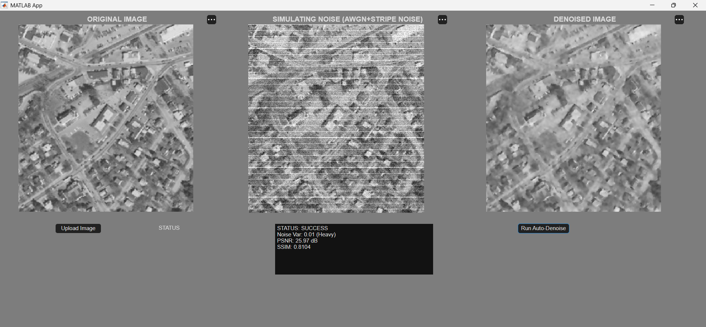

# SPECTRA: Hybrid AI-DSP Satellite Image Reconstruction Pipeline

[](https://www.mathworks.com/products/matlab.html)
[](https://www.mathworks.com/)
[](LICENSE)

> **A 4-stage hybrid architecture combining frequency-domain Fourier notch filtering and Deep Convolutional Neural Networks (DnCNN) with edge-guided spatial fusion to recover severely degraded satellite telemetry images.**

---

<p align="center">
  
  <br>
  <em>Figure 1: SPECTRA Automated Ground-Station Interface displaying real-time telemetry reconstruction under severe thermal noise and horizontal detector striping.</em>
</p>

---

## Executive Summary

Satellite telemetry signals downlinked to ground stations suffer from complex multi-domain degradations:
1. **Periodic Detector Striping:** Caused by sensor element miscalibration across push-broom arrays (horizontal line artifacts).
2. **Thermal Static (AWGN):** Caused by orbital atmospheric interference and receiver noise.

Standard mathematical filters blur high-frequency geographic boundaries, while end-to-end Deep Learning models tend to over-smooth or hallucinate terrain data. **SPECTRA** addresses these limitations through a hybrid ECE architecture that isolates deterministic periodic noise in the **frequency domain** and random thermal static in the **spatial domain**, using AI strictly as a structural base map stencil.

---

## Key Features

* **Frequency Domain Fourier Notch Filter:** Erases periodic horizontal detector lines in the 2D FFT spectrum using a custom Gaussian notch shape.
* **Deep Learning Structural Base Map:** Utilizes DnCNN trained for Additive White Gaussian Noise (AWGN) suppression to generate a smooth base layer.
* **Edge-Guided Spatial Fusion:** Employs `imguidedfilter` to pull crisp physical boundaries (roads, coastlines, structures) directly from the raw input matrix.
* **Real-Time Telemetry:** Computes Peak Signal-to-Noise Ratio (PSNR) and Structural Similarity Index (SSIM) dynamically.

---

## System Architecture & Pipeline Breakdown

| Stage | Operation | Domain | Engineering Purpose |
| :--- | :--- | :--- | :--- |
| **Stage 1** | Degradation Simulation | Spatial | Injects $0.01$ AWGN variance $+ 0.4$ intensity horizontal stripe overlay. |
| **Stage 2** | Gaussian Notch Filtering | Frequency ($2\text{D FFT}$) | Isolates and mathematically zeroes out periodic sensor striping spikes. |
| **Stage 3** | DnCNN Base Map Generation | Spatial | Creates a smooth, static-free structural base layer using deep residual learning. |
| **Stage 4** | Guided Edge Fusion | Spatial | Uses the AI base map as a stencil to pull sharp physical geometry from raw input. |

---

## Telemetry Performance

Metrics logged directly from live ground-station stress tests on complex geographic terrain:

* **Noise Level:** $0.01\text{ Variance (Heavy Thermal Noise + Stripe Overlay)}$
* **Output PSNR:** $25.97\text{ dB}$
* **Output SSIM:** $0.8104$

---

## Quickstart & Setup

### Prerequisites
* MATLAB R2021b or newer
* Image Processing Toolbox
* Deep Learning Toolbox

### Running the Project

1. **Clone the repository:**
   ```bash
   git clone [https://github.com/sanjanaa2102/spectra-satellite-denoising.git](https://github.com/sanjanaa2102/spectra-satellite-denoising.git)
